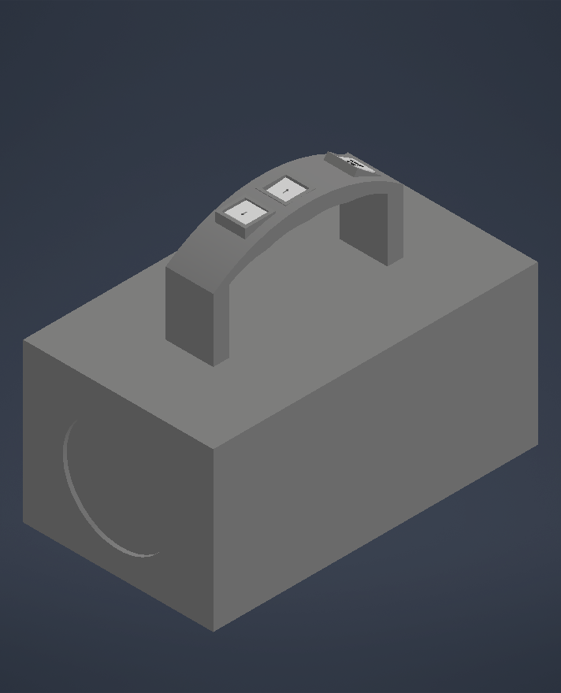
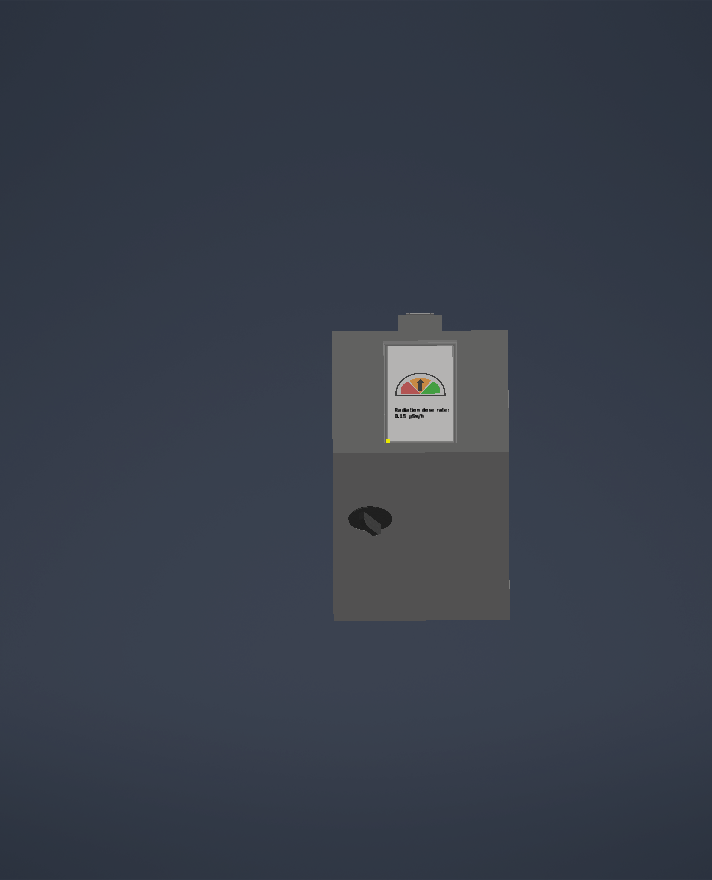
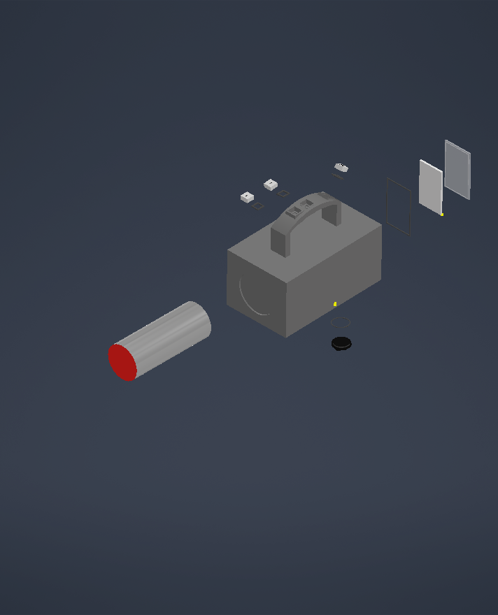
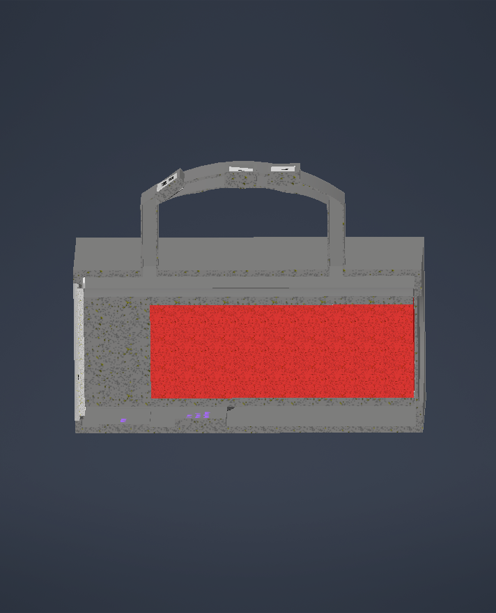
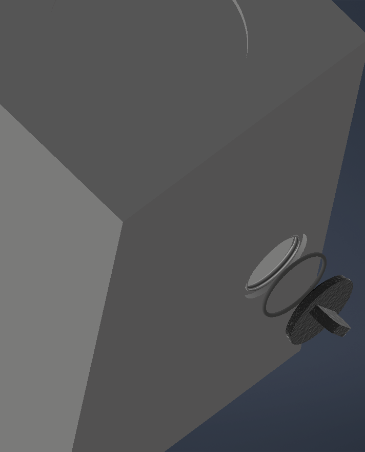
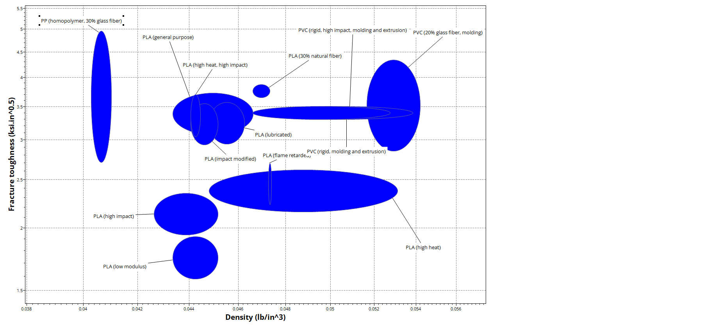
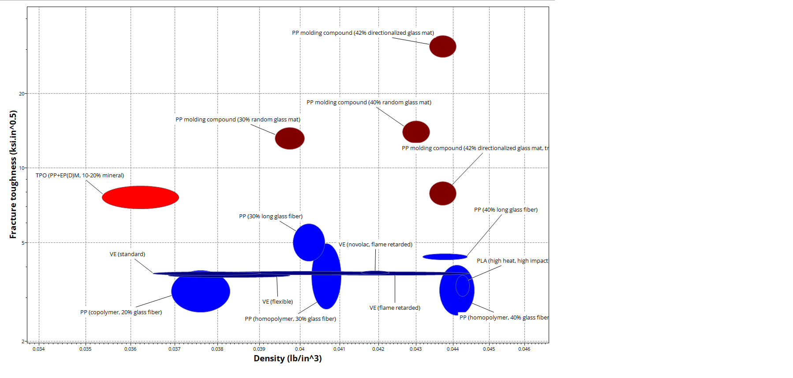
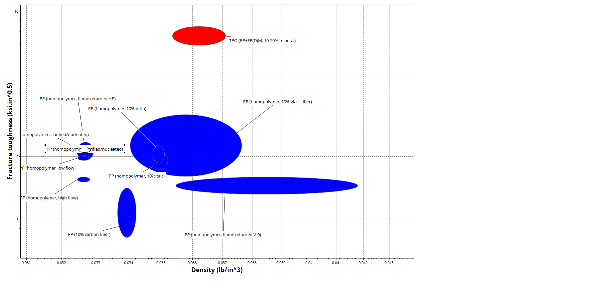

# Portable Radiation Detector Enclosure

A rugged, portable enclosure designed to house a Geiger-Müller radiation
sensor (SBM-20) for emergency-response field use — balancing impact and
environmental protection with the need to keep the sensor's detection
window functional.

**Overall dimensions:** 120mm x 170mm x 205mm



## Methodology

| Stage | Method |
|---|---|
| Design requirements | Defined against IP66/67 (environmental sealing), IK-rated impact resistance, and MIL-STD-810G drop-test conventions for portable field equipment |
| Material selection | Granta EduPack Ashby chart comparison — shortlisted candidates for the main shell, sensor window, and threaded cap against density, fracture toughness, temperature, and price constraints |
| CAD design | Autodesk Inventor Professional — full assembly including sealed access hatch, threaded USB-C charging cap with O-ring seal, and internal component layout |
| Packaging validation | Internal layout checked against real component dimensions — SBM-20 tube (108 x 11mm), 50 x 30mm driver PCB, 40 x 30 x 5mm LiPo pouch cell — within an 11.34mm internal clearance constraint |

## Key design decisions

- **1.5mm sensor detection window** (vs. 4mm main shell wall) — minimises
  radiation attenuation directly in front of the sensor, while the rest of
  the shell stays thicker for impact protection. See cross-section render
  below.
- **Threaded USB-C charging cap with O-ring seal**, mounted on the rear face,
  away from the sensor window — keeps the sealed detection face permanently
  undisturbed during charging or servicing
- **LiPo pouch cell over AA batteries** — driven by a strict 11.34mm internal
  clearance constraint; traded field battery-swapping for sealed USB-C
  recharging
- **Consistent polypropylene material family** across the shell, window, and
  cap, differing only in reinforcement type/level — see
  [`materials/material_comparison.md`](materials/material_comparison.md)
  for full Granta EduPack justification

## Renders

| View | Description |
|---|---|
|  | Isometric hero view — full assembled enclosure |
|  | Rear/base view — digital display and charging cap |
|  | Exploded assembly — shell, sensor, PCB, battery, cap |
|  | Cross-section through the sensor window, showing the 1.5mm window wall vs. 4mm shell wall |
|  | Close-up of the threaded USB-C cap and O-ring seal |

## Materials

Full property data and justification per component:
[`materials/material_comparison.md`](materials/material_comparison.md)

Ashby charts (Fracture Toughness vs. Density) used to shortlist each
component's material:

| Component | Chart |
|---|---|
| Main shell |  |
| Threaded cap |  |
| Sensor window |  |

## Repository contents

```
cad/
├── CBRNE-sensor-enclosure.stp                  Universally-viewable 3D model
└── renders/
    ├── CBRNE-Sensor-enclosure-Orbit-View.png
    ├── CBRNE-Sensor-enclosure-Bottom-and-back-view.png
    ├── CBRNE-Sensor-enclosure-exploded-view.png
    ├── CBRNE-Sensor-enclosure-Cut-View.png
    └── CBRNE-Sensor-enclosure-Hatch-opening.png
drawings/
└── CBRNE-Sensor-enclosure-Assembly-Drawings.pdf   Dimensioned technical drawing
materials/
├── material_comparison.md                      Granta EduPack property data + justification
├── Ashby-chart-Main-Casing.png
├── Ashby-chart-Opening-hatch.png
└── Ashby-chart-Radiation-window.png
```

**Viewing the STEP file:** GitHub does not render 3D files directly — clicking
the `.stp` file shows raw text. Open it in Inventor, Fusion 360, FreeCAD, or
a free online viewer such as [3dviewer.net](https://3dviewer.net) to view it
interactively.

## Note on scope

This project uses a real, well-documented, low-cost Geiger-Müller tube
(SBM-20) as the sensing element. Industrial radiation portal monitors
typically use scintillator-based detectors (e.g. NaI, plastic scintillators)
meeting standards such as ANSI N42.35 and IEC 62244. The focus of this
project is the mechanical and materials engineering challenge of enclosure
design — protecting a radiation-sensitive component without compromising its
detection capability — not the development of detector technology itself,
and it has not been validated against formal CBRNE testing standards.

## Relevance

Directly engages with radiological detection/sensing technology and
critical infrastructure protection themes, applying materials science
(Granta EduPack) and mechanical design (Inventor) to a real security
engineering constraint: protecting sensitive detection equipment in the
field.
